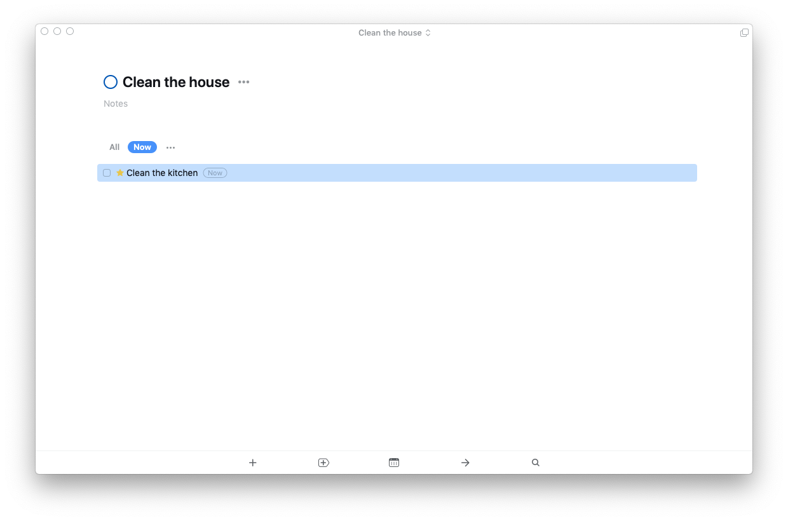

I love the app [Things 3](https://culturedcode.com/things/). I have been using it since it’s design update in (look up when Things 3 released).

My only problem with it is that it does have the ability to defer tasks or hide tasks until I can start them.

However, I’ve found a nice work around to only show the tasks that I’m working in right not.

I created a new tag called `now`.

When I’m working on a task, I add the `now` tag to the task.

Then on the top of the page—usually the Today page for me—select the `now` tag to only show tasks that have that tag.

I usually only add the tag to one task at a time. And more I don’t see any other tasks while I’m working on what’s important. This might seem easy or not that big of a deal, but not seeing clutter ready improves my focus.