I've been using [Visual studio code (VSCode)](https://code.visualstudio.com/) since 2017. It has been one of my all time favorite text editors. This year I decided to look through my set up and document what I use.

## Extensions

### Bracket pair colorizer 2

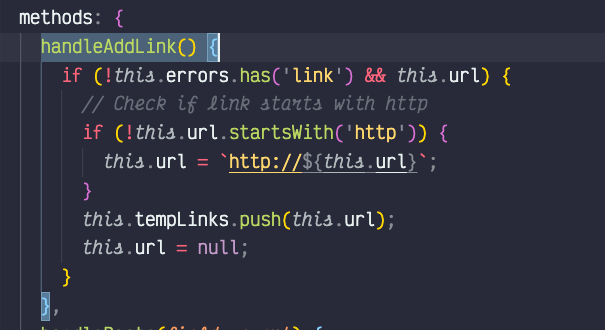

This [extension](https://marketplace.visualstudio.com/items?itemName=CoenraadS.bracket-pair-colorizer-2) is great for focusing on what block of code your looking in. I have some of the more verbose settings enabled so that I can see a lot of colors as I navigate through code. This is especially helpful when I have several nested `functions` or `objects` within each other.

### Change-case

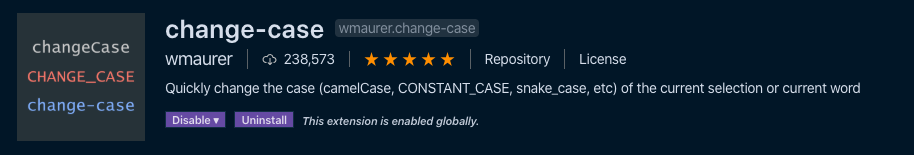

I use this [extension](https://marketplace.visualstudio.com/items?itemName=wmaurer.change-case) via the command palette a lot. Many times I need to transform a pascal case vue.js component into kebab case or vice versa.

### Code spell checker

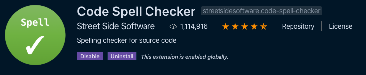

In the course of typing, I make a lot of spelling mistakes. This [extension](https://marketplace.visualstudio.com/items?itemName=streetsidesoftware.code-spell-checker) is a life saver. Plus it helps find little bugs due to typos.

### ESLint

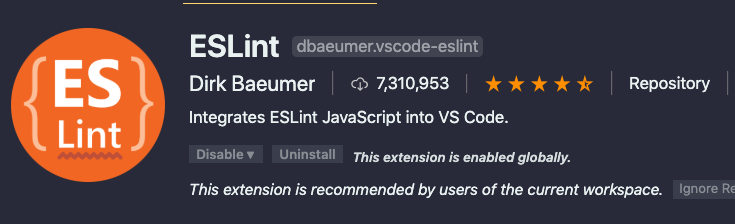

[ESLint](https://marketplace.visualstudio.com/items?itemName=dbaeumer.vscode-eslint) is an essential extension for any JavaScript-based project. Getting all the settings to work are a pain in the ass sometimes, but I couldn't live without it.

### Headwind

This [extension](https://marketplace.visualstudio.com/items?itemName=heybourn.headwind) helps me align my tailwind classes in the same order without having to thing about it. It doesn’t seem like much, but the consistency of the order without having to think about is awesome.

### Tailwind CSS intelliSence

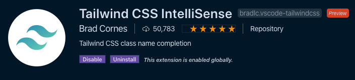

[IntelliSence](https://marketplace.visualstudio.com/items?itemName=bradlc.vscode-tailwindcss) is a great feature of VSCode. Why not have it know about my Tailwind classes? Very useful for remembering the number differences for spacing and colors.

### Toggle quotes

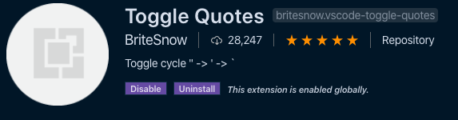

This [extension](https://marketplace.visualstudio.com/items?itemName=BriteSnow.vscode-toggle-quotes) seems like it would be native to VSCode along with all the other text transformation tools. I can easily switch between single quotes, double quotes, and back ticks. I even like the default keyboard shortcut `control + ‘`.

### Vetur

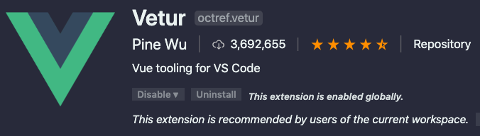

[Vetur](https://marketplace.visualstudio.com/items?itemName=octref.vetur) gives you easy integration with all things Vue in VSCode. It's an essential extension for working with Vue projects. What are you waiting for, download this package right now!

### Vscode-icons

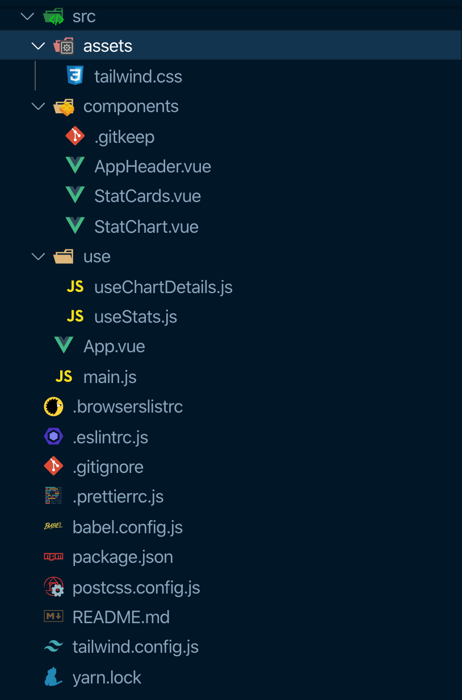

I've used the [vscode-icon](https://marketplace.visualstudio.com/items?itemName=vscode-icons-team.vscode-icons) set since I started using Visual Studio Code. I'm so used to them now, I don't want to switch.

### Vue vscode snippets

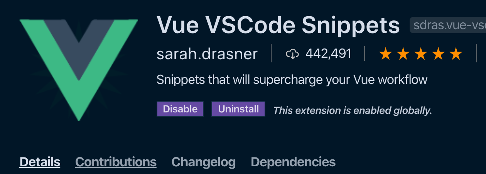

The [best snippet](https://marketplace.visualstudio.com/items?itemName=sdras.vue-vscode-snippets) package for Vue.js. I sometimes forget the format of certain features because this package has so many good snippets.

### Quick and simple text selection

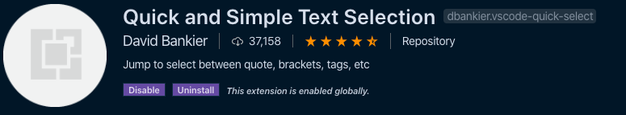

I've used this [extension](https://marketplace.visualstudio.com/items?itemName=dbankier.vscode-quick-select) so much I thought it was baked into VSCode! It makes selecting text within characters—think `''`, `""`, `[]`, and `()`—a keyboard shortcut away. When I have to do a lot of irregular find and replace tasks, this extension haves my life.

### Text Marker

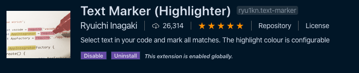

Sometimes I need to highlight a piece of code to copy, refactor, delete, etc. This [extension](https://marketplace.visualstudio.com/items?itemName=ryu1kn.text-marker) does the trick! I try to use it sparingly and clear all highlights when I'm done.

## Font

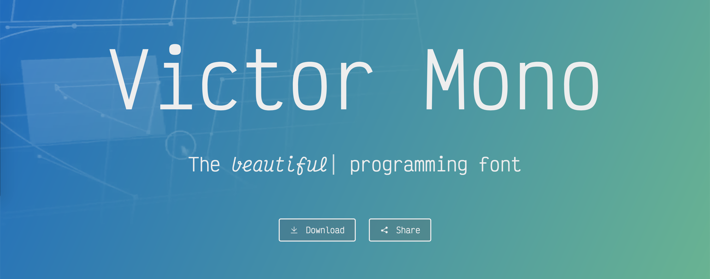

[Victor mono](https://rubjo.github.io/victor-mono/) was my most used font in 2019. Along with the ligatures and the cursive italic variant, the large x-height makes it easy for me to read.

If it works well for you, consider donating to the creator.

### Italic cursive face not working in VSCode

(Mar 12, 2020 Update)

There is a bug with [VSCode font rendering for macOS](https://github.com/microsoft/vscode/issues/82122). If this is happening for you, there is a simple work around. Open up the Font Book app, find the Victor Mono font and disable or delete all "oblique" faces. The "oblique" faces were getting applied instead of the "italic" faces.

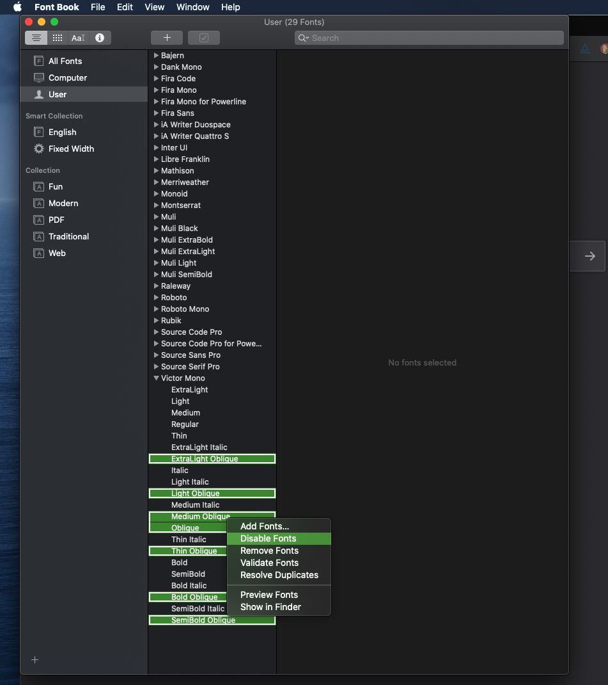

## Themes

I like color themes. I like having a lot of color themes to choose from. I like light themes for when the sun is out and there is a glare from the window. I like dark themes for the rest of the time.

I tried to stick with one theme for a little while, but I can never make one last. So I keep a handful around and change whenever I feel like it—the `cmd + k cmd + t` shortcut is handy for quick switching.

### Cobalt2

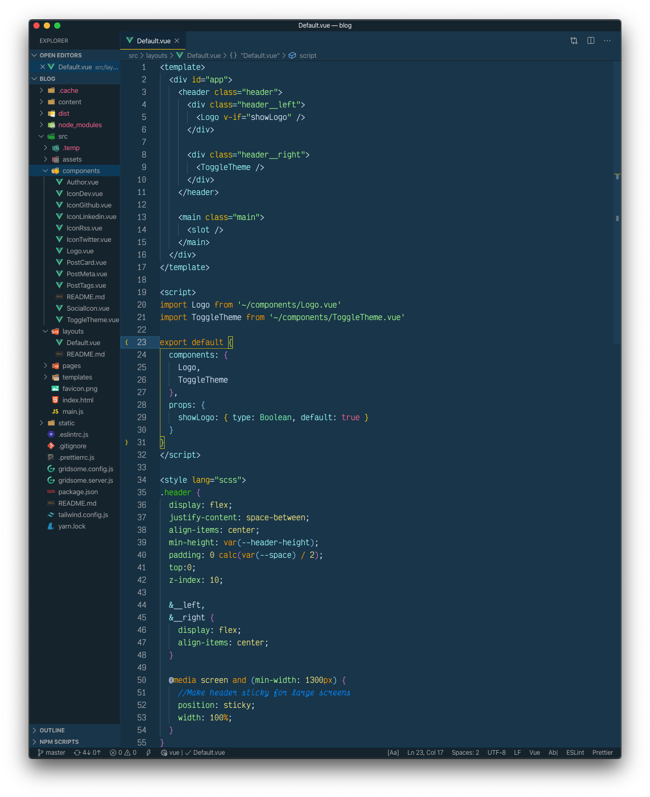

A classic blue and yellow [theme](https://marketplace.visualstudio.com/items?itemName=wesbos.theme-cobalt2) from [Wes Bos](https://wesbos.com/). I tend to not use it, as I think it's too bright for me. But it has a great highlight search color when doing a "Find in files".

### Dracula

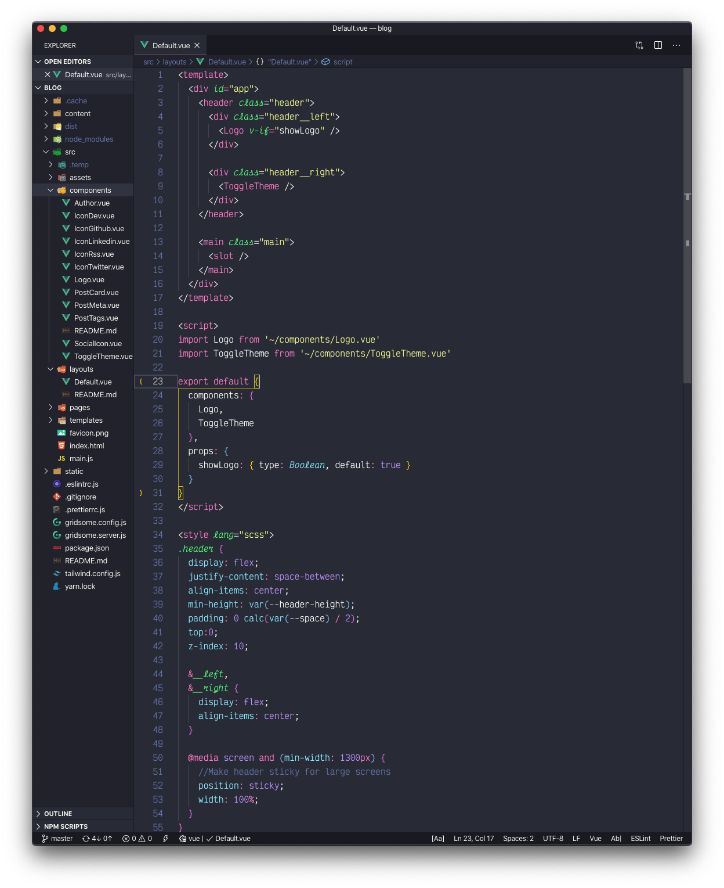

Great dark [theme](https://marketplace.visualstudio.com/items?itemName=dracula-theme.theme-dracula) with purples and pinks. This theme puts a solid vertical pink line between editors when you're in split mode, which I really like. So when I am working with two or three splits for long periods of time, I switch to this theme.

### Monokai pro

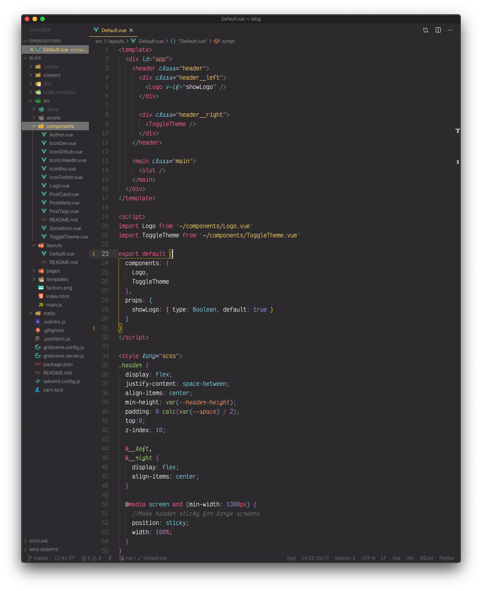

This [theme](https://marketplace.visualstudio.com/items?itemName=monokai.theme-monokai-pro-vscode) costs money, but there is a free trial. I'd say it is well worth it since it comes with an icon theme—which I don't use. This is my "home base" theme. I might not use it all the time, but I always come back to it eventually.

### Light owl

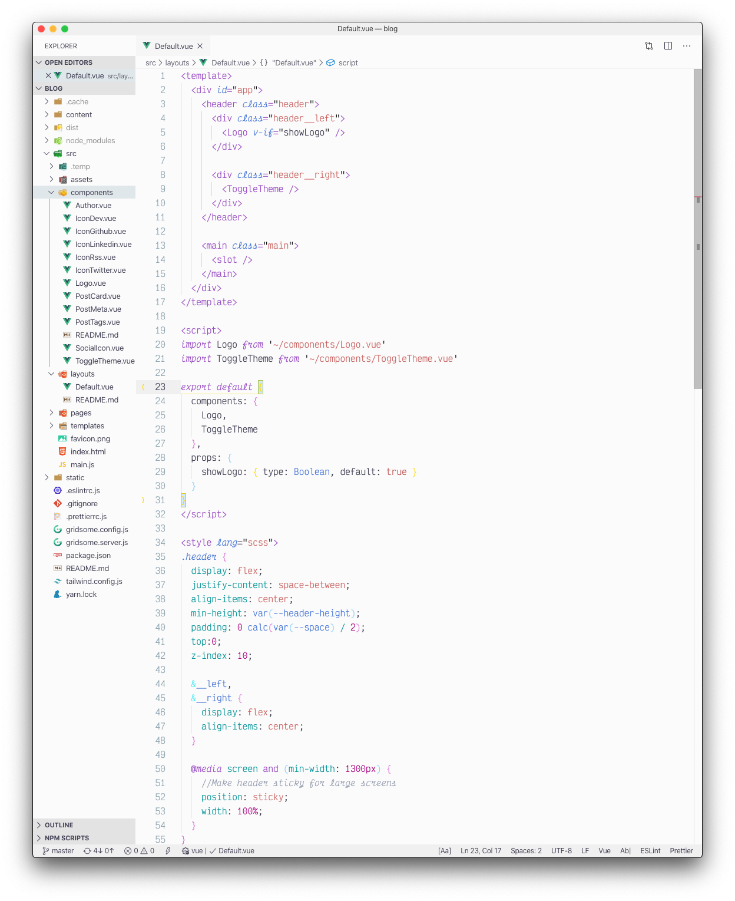

My favorite light theme. Just enough color to be nice, but everything is still readable. It comes with [Night Owl](https://marketplace.visualstudio.com/items?itemName=sdras.night-owl), so a two for one situation.

### Night owl

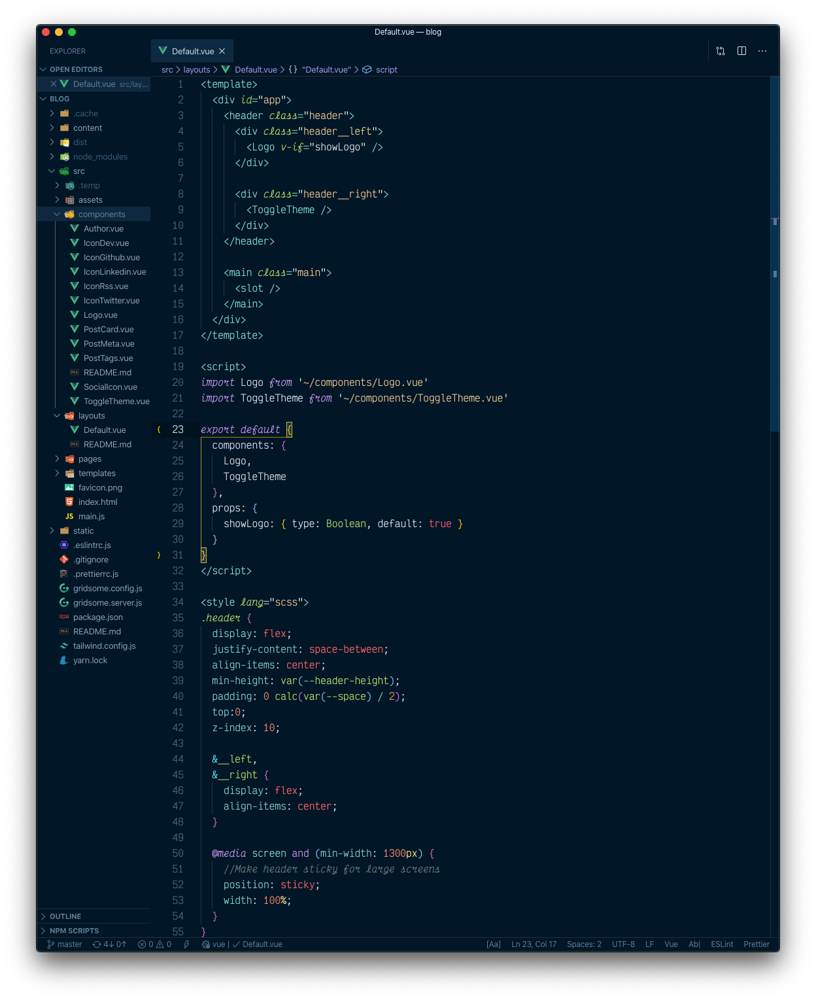

A great [theme](https://marketplace.visualstudio.com/items?itemName=sdras.night-owl) for late night coding. [Sarah Drasner](https://sarahdrasnerdesign.com/) really put a lot of TLC into this theme.

### Overnight Slumber Italics

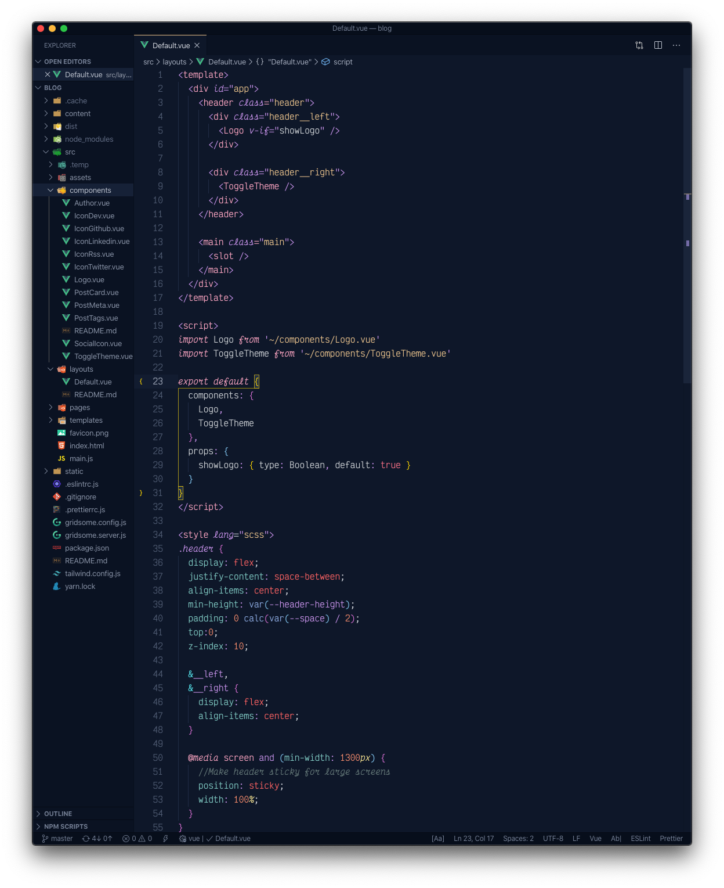

I haven't used this theme very much, but I like the peach and purple vibe of [this theme](https://marketplace.visualstudio.com/items?itemName=cev.overnight). I think I like the "slumber" alternative better than the base theme.

### SynthWave '84

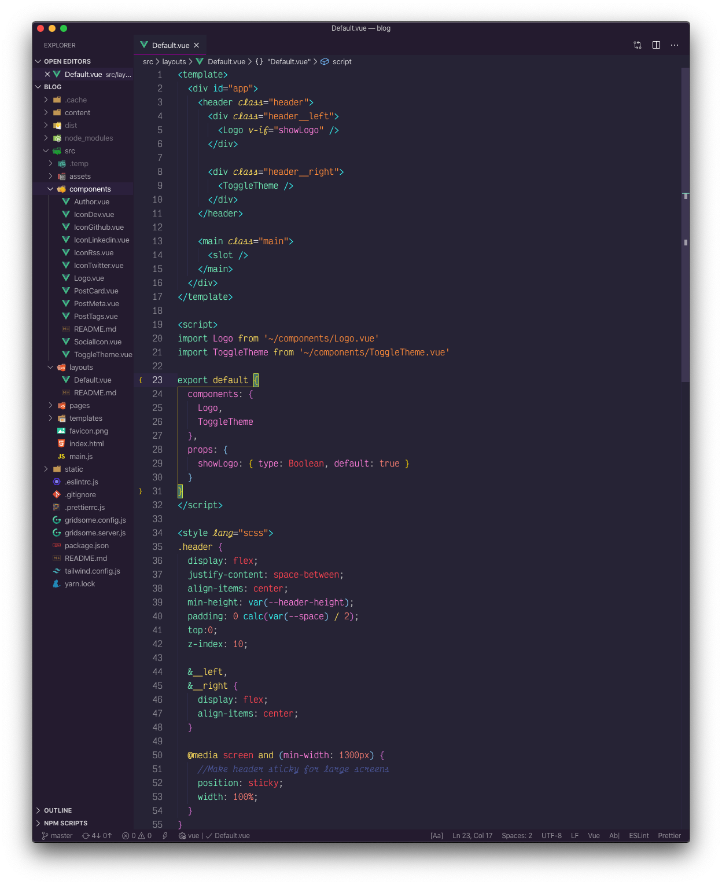

SUPER POP COLORS! When I really need to tell the difference between variables and functions, I turn on [this theme](https://marketplace.visualstudio.com/items?itemName=RobbOwen.synthwave-vscode). I don't turn on the custom glow CSS because glow is very distracting to me.

## Thanks for reading

Next up I'll be writing up what keyboard shortcuts I use and customized to save myself time.

What extensions/themes do you use for VSCode? I'd love to hear about your setup!
